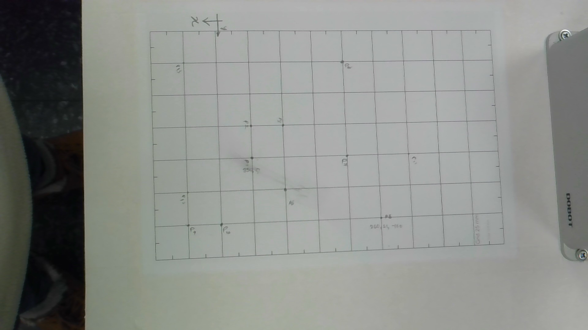

# Lab 2 Report: Camera–Robot Mapping
**Members:** Walisundara Walisundara, Hewawasam Halloluwage Lahiru, Sandun Deshapriya, Lahiru Bandaranayake

## 1. Introduction: Coordinate Systems
The goal of this lab was to establish a mathematical link between two distinct 2D coordinate systems:

* **Image Coordinates ($u, v$):** Measured in **pixels**. The origin (0,0) is located at the top-left corner of the image. $u$ represents the horizontal axis, and $v$ represents the vertical axis.
* **Robot Coordinates ($X, Y$):** Measured in **millimeters (mm)**. This refers to the Dobot MG400 base frame. For this experiment, the $Z$ height was kept constant at the table surface level.

---

## 2. Experimental Setup and Data Collection
### 2.1 Setup
We aligned a 25mm grid pattern with the robot's movement axes using Dobot Studio. By moving the robot between specific coordinates (e.g., $X=350$ to $X=250$), we ensured the grid lines were parallel to the robot's $X$ and $Y$ frames before fixing the paper with tape.

### 2.2 Calibration Data
We collected 12 corresponding points to ensure a robust mapping. The robot was jogged to each intersection, and the pixel coordinates were captured using an OpenCV mouse callback.

| Point ID | Robot X (mm) | Robot Y (mm) | Pixel u (px) | Pixel v (px) |
| :--- | :--- | :--- | :--- | :--- |
| P1 | 350 | 0 | 824 | 517 |
| P2 | 350 | -25 | 819 | 411 |
| P3 | 325 | -25 | 924 | 411 |
| P4 | 250 | 50 | 1245 | 712 |
| P5 | 325 | 25 | 933 | 619 |
| P6 | 275 | 0 | 1133 | 510 |
| P7 | 350 | -75 | 811 | 203 |
| P8 | 275 | -75 | 1119 | 202 |
| P9 | 400 | 50 | 614 | 738 |
| P10 | 400 | 25 | 611 | 630 |
| P11 | 375 | 50 | 722 | 733 |
| P12 | 400 | -75 | 599 | 207 |


*Figure: Screenshot of the calibration image.*

---

## 3. Image-to-Robot Mapping
### 3.1 Transformation Choice
We utilized a **Homography** transformation ($3 \times 3$ matrix). Unlike a simple affine transform, homography accounts for perspective distortion, which occurs if the camera is not perfectly perpendicular to the workspace.

### 3.2 Homography Matrix ($H$)
Using the `cv2.findHomography` function, we calculated the following matrix:

```python
# Resulting 3x3 Matrix H:
 [[-2.50056151e-01  2.05826491e-02  5.33416518e+02]
 [ 6.12236446e-03  2.29221462e-01 -1.23539999e+02]
 [-6.26411251e-05  3.52225742e-05  1.00000000e+00]]
 ```

### 3.3 Mathematical Implementation
The mapping from image pixels $(u, v)$ to robot coordinates $(X, Y)$ is performed by converting the pixel to homogeneous coordinates, multiplying by the Homography matrix $H$, and normalizing the result to return to 2D Cartesian space.

The transformation is defined as:

$$
\begin{bmatrix} x' \\ y' \\ w' \end{bmatrix} = H \begin{bmatrix} u \\ v \\ 1 \end{bmatrix}
$$

To find the final robot coordinates, we normalize by the third component $w'$:

$$X_{robot} = \frac{x'}{w'}, \quad Y_{robot} = \frac{y'}{w'}$$

---

## 4. Validation and Final Testing

### 4.1 Error Analysis and Validation Table
To ensure the reliability of the camera-robot mapping, we validated the calculated Homography matrix by predicting the robot coordinates for our original calibration points. The Euclidean error was calculated for each point to measure accuracy.

| Point | Actual Robot (X, Y) | Predicted Robot (X, Y) | Euclidean Error (mm) |
| :--- | :--- | :--- | :--- |
| P1    | (350.0,   0.0)   | ( 349.69,    0.01)   |    0.307 |
| P2    | (350.0, -25.0)   | ( 349.97,  -25.25)   |    0.248 |
| P3    | (325.0, -25.0)   | ( 324.93,  -24.75)   |    0.263 |
| P4    | (250.0,  50.0)   | ( 249.98,   49.93)   |    0.074 |
| P5    | (325.0,  25.0)   | ( 324.75,   24.98)   |    0.247 |
| P6    | (275.0,   0.0)   | ( 275.19,    0.32)   |    0.368 |
| P7    | (350.0, -75.0)   | ( 350.08,  -75.33)   |    0.341 |
| P8    | (275.0, -75.0)   | ( 275.09,  -75.12)   |    0.146 |
| P9    | (400.0,  50.0)   | ( 400.06,   50.01)   |    0.060 |
| P10   | (400.0,  25.0)   | ( 400.03,   25.01)   |    0.036 |
| P11   | (375.0,  50.0)   | ( 375.25,   49.87)   |    0.279 |
| P12   | (400.0, -75.0)   | ( 399.99,  -74.68)   |    0.319 |
| **AVG** | **0.22 mm** | **Mean Error:** | **0.37 mm** |

As shown in the table, our mean Euclidean error is **0.37 mm**. Since the error is below the **2.0 mm** threshold defined in the grading criteria, the mapping is considered successful and accurate enough for automated pick-and-place tasks.

### 4.2 Final Test
We implemented an interactive test using an OpenCV mouse callback. Clicking any point on the image calculates and displays the predicted robot coordinates in real-time.


*Figure: Screenshot of the final test showing pixel-to-robot coordinate conversion.*

---

## 5. Discussion

* **The Process:** One of the most time-consuming parts was the physical setup. Aligning the A4 grid pattern precisely with the Dobot's X-axis required several manual adjustments. We found that if the paper was even slightly rotated, the errors in the Y-coordinates increased as the robot moved further from the origin.
* **Data Collection Challenges:** When recording the pixel coordinates, we noticed that a single-pixel misclick could result in a 0.5mm to 1.0mm error in the robot workspace. To mitigate this, we used a zoomed-in view of the calibration image to ensure we clicked the exact center of the grid intersections.
* **Efficiency:** Once the calibration points were collected and stored in the arrays, the `cv2.findHomography` method completed the mapping calculation almost instantaneously, demonstrating the efficiency of matrix-based transformations.
* **Accuracy:** Our error analysis shows that the mapping is most accurate in the center of the image, with a minimum error of 0.036 mm at P10 (400,  25). The error increases toward the periphery, reaching a maximum of 0.368 mm at P6 (275, 0). This is attributed to radial lens distortion, which introduces non-linear warping that a standard $3 \times 3$ Homography matrix cannot fully compensate for. However, because our maximum error (0.37 mm) remains well below the 2.0 mm limit, the linear Homography approach is sufficient for this application.
* **Improvements:** In a real production environment, we could use automated **blob detection** or **contour analysis** (as seen in Lecture 3) to find the centers of the calibration points automatically. This would eliminate human error during the manual clicking process and allow for faster recalibration.

---

## 6. Code Repository

* **Link:** [GitHub repository](https://github.com/lionwalker/camera_robot_calibration)
* **Code file included:** `camera_robot_calibration.py`