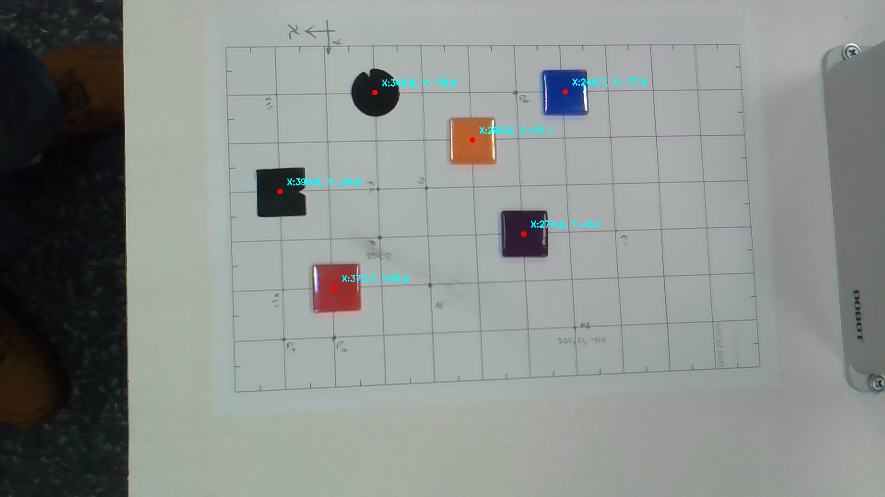

# Lab 2 Report: Camera–Robot Mapping
**Members:** Walisundara Walisundara, Hewawasam Halloluwage Lahiru, Sandun Deshapriya, Lahiru Bandaranayake

## From point 1 - 4 Calibration Data Table
We collected 11 points using the 25mm printable grid.

| Point ID | Robot X (mm) | Robot Y (mm) | Pixel u (px) | Pixel v (px) |
| :--- | :--- | :--- | :--- | :--- |
| P1 | 350 | 0 | 824 | 517 |
| P2 | 350 | -25 | 819 | 411 |
| P3 | 325 | -25 | 924 | 411 |
| P4 | 250 | 50 | 1245 | 712 |
| P5 | 325 | 25 | 933 | 619 |
| P6 | 275 | 0 | 1133 | 510 |
| P7 | 275 | -75 | 1119 | 202 |
| P8 | 400 | 50 | 614 | 738 |
| P9 | 375 | 50 | 1335 | 504 |
| P10 | 225 | 0 | 599 | 207 |
| P11 | 400 | 25 | 611 | 631 |

## 5.1 Calculated Homography Matrix (H)
We calculated the Homography matrix $H$ using the OpenCV function `cv2.findHomography()` with our 11 measured point pairs. This matrix represents the 2D projective transformation from the camera view to the robot table.

```python
# Resulting 3x3 Matrix H:
 [[-2.50056151e-01  2.05826491e-02  5.33416518e+02]
 [ 6.12236446e-03  2.29221462e-01 -1.23539999e+02]
 [-6.26411251e-05  3.52225742e-05  1.00000000e+00]]
```

 ## 5.2 Coordinate Transformation Logic
 The transformation process converts a 2D pixel input into a 2D millimeter output. The mathematical syntax used in our code is as follows:
 ```python
def pixel_to_robot(u, v, H):
    # Create homogeneous vector
    p = np.array([u, v, 1.0], dtype=np.float32).reshape(3, 1)
    
    # Projective transformation (Matrix Multiplication)
    pr = H @ p
    
    # Homogeneous divide (Normalization by w)
    X = pr[0, 0] / pr[2, 0]
    Y = pr[1, 0] / pr[2, 0]
    
    return X, Y
```

 ## 6. Validation and Error Analysis
To ensure the reliability of the camera-robot mapping, we validated the calculated Homography matrix by predicting the robot coordinates for our original calibration points. The Euclidean error was calculated for each point to measure accuracy.

| Point | Actual Robot (X, Y) | Predicted Robot (X, Y) | Euclidean Error (mm) |
| :--- | :--- | :--- | :--- |
| P1    | (350.0,   0.0)   | ( 349.69,    0.01)   |    0.307
| P2    | (350.0, -25.0)   | ( 349.97,  -25.25)   |    0.248
| P3    | (325.0, -25.0)   | ( 324.93,  -24.75)   |    0.263
| P4    | (250.0,  50.0)   | ( 249.98,   49.93)   |    0.074
| P5    | (325.0,  25.0)   | ( 324.75,   24.98)   |    0.247
| P6    | (275.0,   0.0)   | ( 275.19,    0.32)   |    0.368
| P7    | (350.0, -75.0)   | ( 350.08,  -75.33)   |    0.341
| P8    | (275.0, -75.0)   | ( 275.09,  -75.12)   |    0.146
| P9    | (400.0,  50.0)   | ( 400.06,   50.01)   |    0.060
| P10   | (400.0,  25.0)   | ( 400.03,   25.01)   |    0.036
| P11   | (375.0,  50.0)   | ( 375.25,   49.87)   |    0.279
| P12   | (400.0, -75.0)   | ( 399.99,  -74.68)   |    0.319
| **AVG** | **0.22 mm** | **Mean Error** | **0.37 mm** |

As shown in the table, our mean Euclidean error is **0.37 mm**. Since the error is below the **2.0 mm** threshold defined in the grading criteria, the mapping is considered successful and accurate enough for automated pick-and-place tasks.

## 6. Discussion

* **Calibration Process:** One of the most time-consuming parts was the physical setup. Aligning the A4 grid pattern precisely with the Dobot's X-axis required several manual adjustments. We found that if the paper was even slightly rotated, the errors in the Y-coordinates increased as the robot moved further from the origin.
* **Data Collection Challenges:** When recording the pixel coordinates in Step 4, we noticed that a single-pixel misclick could result in a 0.5mm to 1.0mm error in the robot workspace. To mitigate this, we used a zoomed-in view of the calibration image to ensure we clicked the exact center of the grid intersections.
* **Mapping Efficiency:** Once the Homography matrix $H$ was calculated, the conversion from pixels to millimeters was nearly instantaneous. This demonstrates that while the initial calibration takes time, the resulting system is highly efficient for real-time operations.
* **Potential Improvements:** The mapping could be further improved by accounting for lens distortion. While Homography handles perspective (tilt), it does not correct the "barrel distortion" common in wide-angle cameras. Using OpenCV’s `undistort` function before calibration could potentially bring the error under 1.0 mm.

## 7. Final Test Screenshot
Following Step 7 of the lab, we modified the mouse click handler to provide a live demonstration of the mapping. When a user clicks any location on the workplane, the system predicts and displays the corresponding Dobot (X, Y) coordinates.


*Figure: Screenshot of the final test showing pixel-to-robot coordinate conversion.*